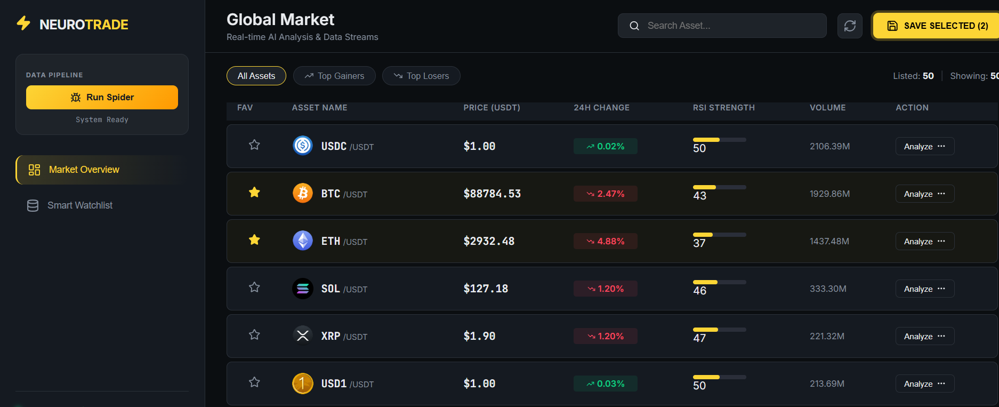
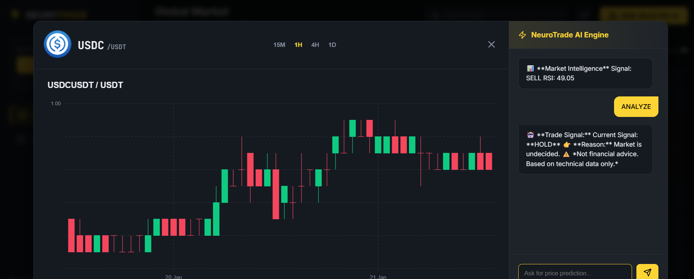
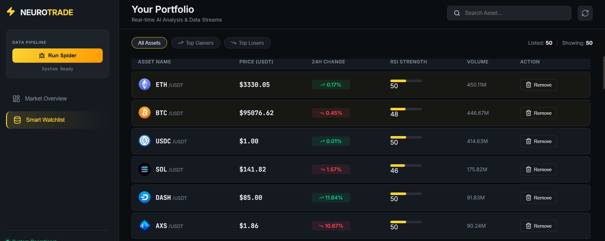

# NeuroTrade: Intelligent Market Analysis & Data Pipeline


## 📖 Executive Summary

**NeuroTrade** is a high-performance financial technology platform designed to bridge the gap between raw market data and actionable investment insights. By leveraging advanced web scraping algorithms and real-time data processing, NeuroTrade filters through market noise to deliver precise technical analysis.

The system is engineered to handle high-frequency data ingestion from major cryptocurrency exchanges, storing processed metrics in a scalable NoSQL database, and visualizing complex indicators (RSI, Trend Analysis) through a user-friendly dashboard.

---

## 💻 System Architecture & Interface

### 1. Global Market Intelligence
The core dashboard aggregates real-time data streams, applying algorithmic logic to identify market movements instantly.


### 2. AI-Driven Signal Engine
A dedicated analytical module that processes historical data against technical indicators to generate "Buy/Sell/Hold" signals with calculated confidence levels.


### 3. Smart Watchlist & Portfolio Management
Personalized tracking system allowing users to monitor specific assets with dynamic RSI (Relative Strength Index) updates.


---

## ⚙️ Key Technical Features

### High-Throughput Data Extraction
* **Scrapy Architecture:** Utilizes a custom-built spider capable of concurrent requests to fetch live pricing, volume, and fluctuation data with minimal latency.
* **Anti-Blocking Mechanisms:** Implements middleware strategies to ensure continuous data flow without IP bans or rate limiting.

### Algorithmic Processing
* **Technical Indicators:** Automated calculation of critical trading metrics including RSI (Relative Strength Index), Moving Averages, and Volatility indices.
* **Decision Support System:** The "AI Engine" interprets numerical data to provide human-readable trade recommendations based on predefined financial strategies.

### Scalable Data Persistence
* **NoSQL Implementation:** Uses **MongoDB** to handle unstructured financial data, ensuring fast read/write operations for real-time dashboard updates.
* **Data Integrity:** Automated cleaning pipelines ensure that only valid and consistent market data enters the analytical engine.

---

## 🛠️ Technology Stack

| Component | Technology | Description |
| :--- | :--- | :--- |
| **Data Engineering** | Python, Scrapy | Asynchronous web crawling and data extraction pipeline. |
| **Backend Logic** | Python, Pandas | Data manipulation, cleaning, and financial calculations. |
| **Database** | MongoDB | Document-oriented storage for scalable market data history. |
| **Frontend UI** | Modern Web Technologies | Interactive dashboard for data visualization and user interaction. |

---

## 🚀 Installation & Setup

To deploy the NeuroTrade system locally, follow these steps:

1.  **Clone the Repository**
    ```bash
    git clone [https://github.com/MertTomak/NeuroTrade.git](https://github.com/MertTomak/NeuroTrade.git)
    cd NeuroTrade
    ```

2.  **Environment Setup**
    ```bash
    # Create virtual environment
    python -m venv venv
    source venv/bin/activate  # On Windows: venv\Scripts\activate
    ```

3.  **Install Dependencies**
    ```bash
    pip install -r requirements.txt
    ```

4.  **Run the Data Spider**
    ```bash
    cd Backend
    scrapy crawl market_spider
    ```

---

## 🔮 Future Roadmap

* **Machine Learning Integration:** Implementing LSTM (Long Short-Term Memory) networks for predictive price modeling.
* **API Integration:** Direct connection to exchange APIs (Binance, Coinbase) for live trading execution.
* **Mobile Application:** Developing a React Native counterpart for mobile notifications.

---

## 👨‍💻 Author

**Mert Tomak**
* *Computer Engineering Student & Full Stack Developer*
* **Specialization:** Data Engineering, Fintech Architectures, Backend Development.
* **Contact:** [Linkedin Profile Link]